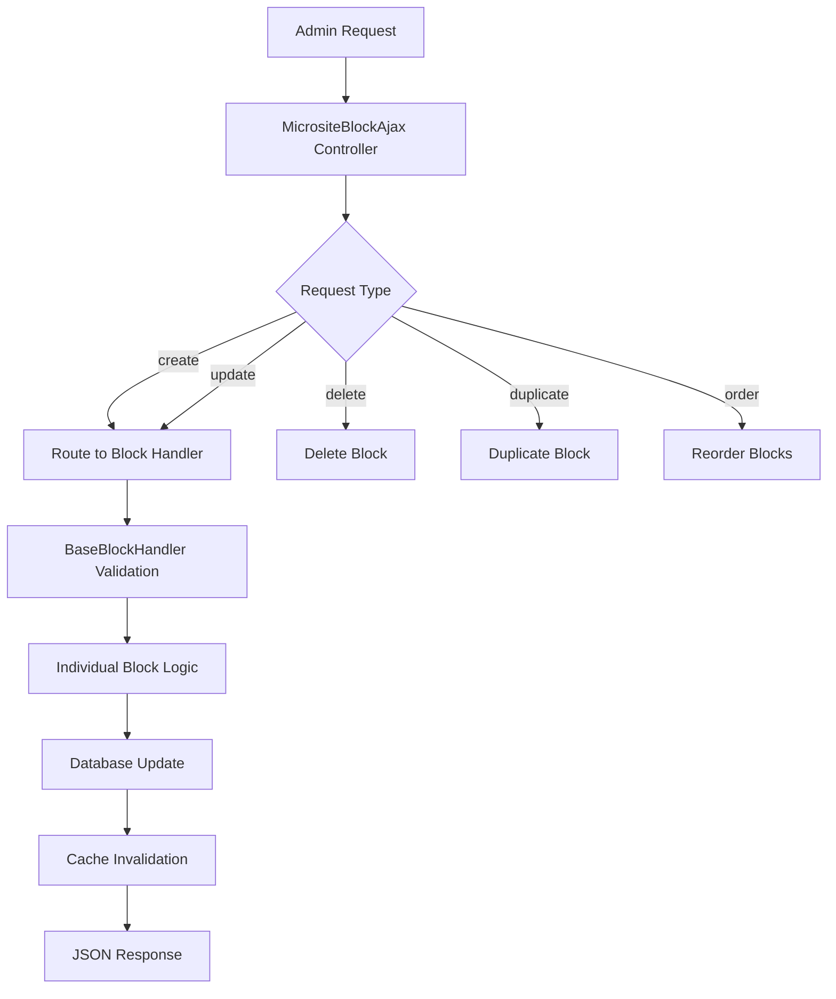
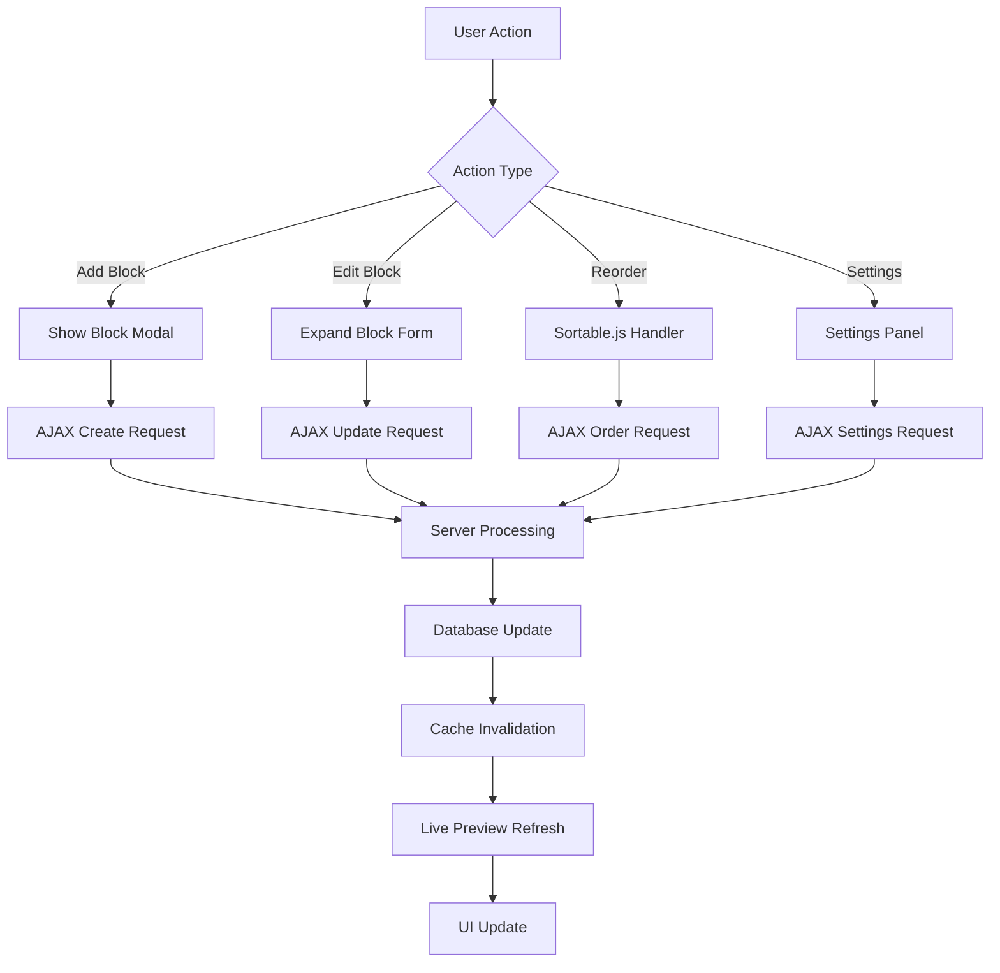
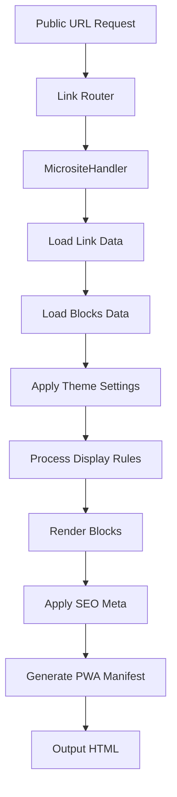

# 🏗️ Microsite Blocks Architecture Documentation

## 📋 Table of Contents

1. [Overview](#overview)
2. [Architecture Components](#architecture-components)
3. [Admin Side Architecture](#admin-side-architecture)
4. [Client Side Architecture](#client-side-architecture)
5. [Public Side Architecture](#public-side-architecture)
6. [Plan Management System](#plan-management-system)
7. [Admin Panel Configuration](#admin-panel-configuration)
8. [Block Types & Categories](#block-types--categories)
9. [Technical Implementation](#technical-implementation)
10. [Developer Guide](#developer-guide)
11. [Configuration & Deployment](#configuration--deployment)

---

## 🎯 Overview

The microsite blocks system is a sophisticated, modular architecture that was recently refactored from a monolithic 4,000+ line controller into 65+ individual block handlers. This system enables users to create dynamic microsite pages with various content blocks, each with specific functionality and customization options.

### Key Features
- **65+ Block Types**: Content, social media, e-commerce, file-based blocks
- **Modular Architecture**: Each block type has its own handler class
- **Plan-Based Restrictions**: Feature access controlled by user subscription plans
- **Theme System**: Customizable appearance with 65+ themes
- **Real-time Preview**: Live editing with instant visual feedback
- **Admin Controls**: Comprehensive management through admin panel

---

## 🔧 Architecture Components

### 1. Core Interface Layer

```php
namespace Altum\Controllers\MicrositeBlocks\Interfaces;

interface BlockHandlerInterface {
    public function create($type);           // Create new block
    public function update($type);           // Update existing block
    public function validate($type, $data);  // Validate block data
    public function getSupportedTypes();     // Get supported block types
}
```

### 2. Base Handler Layer

```php
namespace Altum\Controllers\MicrositeBlocks;

abstract class BaseBlockHandler implements BlockHandlerInterface {
    // Shared functionality for all blocks:
    // - File upload management
    // - Display settings processing
    // - Theme integration
    // - Cache management
    // - Security validation
}
```

### 3. Individual Block Handlers

Each of the 65+ block types extends `BaseBlockHandler`:

```
app/controllers/microsite-blocks/blocks/
├── LinkBlock.php              # Basic link blocks
├── HeadingBlock.php           # Text headings (h1-h6)
├── EmailCollectorBlock.php    # Email collection forms
├── YoutubeBlock.php           # YouTube video embeds
├── SpotifyBlock.php           # Spotify music embeds
├── PaypalBlock.php            # PayPal payment buttons
└── ... (60+ more block types)
```

---

## 🎛️ Admin Side Architecture

### Core Controllers

#### Main Routing Controller
- **File**: `app/controllers/MicrositeBlockAjax.php`
- **Purpose**: Routes requests to individual block handlers
- **Key Methods**:
  - `create()` - Routes block creation requests
  - `update()` - Routes block update requests
  - `delete()` - Handles block deletion
  - `duplicate()` - Handles block duplication
  - `order()` - Manages block ordering

#### Plan Management Controllers
- **Files**: 
  - `app/controllers/admin/AdminPlanCreate.php`
  - `app/controllers/admin/AdminPlanUpdate.php`
- **Purpose**: Configure plan settings and microsite block restrictions

### Admin Workflow



### Key Admin Features

1. **Block Management**
   - Create, update, delete, duplicate blocks
   - Drag & drop reordering
   - Enable/disable individual blocks
   - Bulk operations

2. **Plan Configuration**
   - Set microsite block limits per plan
   - Enable/disable specific block types
   - Configure feature restrictions

3. **Theme Management**
   - Assign themes to plans
   - Configure default themes
   - Customize theme settings

---

## 👤 Client Side Architecture

### User Interface Layout

The client interface uses a **three-column responsive layout**:

```
┌─────────────────────────────────────────────────────────────┐
│                    Microsite Editor Interface                 │
├─────────────────┬─────────────────┬─────────────────────────┤
│   Left Column   │  Center Column  │     Right Column        │
│                 │                 │                         │
│ Block Management│  Live Preview   │   Settings Panel        │
│                 │                 │                         │
│ • Block List    │ • Real-time     │ • Theme Settings        │
│ • Add Blocks    │   Preview       │ • Customization         │
│ • Drag & Drop   │ • Mobile View   │ • Advanced Options      │
│ • Enable/Disable│ • Interactions  │ • SEO Settings          │
│                 │                 │                         │
└─────────────────┴─────────────────┴─────────────────────────┘
```

### Client-Side Technologies

1. **JavaScript Libraries**
   - **Pickr**: Advanced color picker
   - **Sortable.js**: Drag & drop functionality
   - **Select2**: Enhanced select dropdowns
   - **jQuery**: DOM manipulation and AJAX

2. **CSS Framework**
   - **Bootstrap 4**: Responsive grid system
   - **Custom CSS**: Microsite-specific styling
   - **Font Awesome**: Icon library

3. **Real-time Features**
   - **Live Preview**: Instant iframe updates
   - **AJAX Forms**: Seamless form submissions
   - **Auto-save**: Automatic saving of changes

### Client Workflow



---

## 🌐 Public Side Architecture

### Link Handlers

#### Main Microsite Handler
- **File**: `app/controllers/link-handlers/handlers/MicrositeHandler.php`
- **Purpose**: Renders public microsite pages
- **Features**:
  - Theme application
  - Block rendering
  - SEO optimization
  - PWA support

#### Base Link Handler
- **File**: `app/controllers/link-handlers/BaseLinkHandler.php`
- **Purpose**: Shared functionality for all link types

### Public Rendering Flow



### Public Features

1. **Responsive Design**
   - Mobile-first approach
   - Adaptive layouts
   - Touch-friendly interactions

2. **Theme System**
   - 65+ pre-built themes
   - Custom CSS support
   - Font customization

3. **SEO Optimization**
   - Meta tags
   - Open Graph
   - Structured data
   - Custom titles/descriptions

4. **Analytics & Tracking**
   - Pixel integration
   - UTM parameters
   - Click tracking
   - Conversion metrics

---

## 📊 Plan Management System

### Plan Settings Structure

Plans control access to microsite features through a comprehensive settings system:

```php
$plan_settings = [
    // Block Limits
    'microsite_blocks_limit' => 50,        // Max blocks per microsite (-1 = unlimited)
    'microsites_limit' => 10,              // Max microsites per user
    
    // Feature Access
    'enabled_microsite_blocks' => [        // Allowed block types
        'link' => true,
        'heading' => true,
        'email_collector' => true,
        'youtube' => false,              // Premium feature
        // ... all 65+ block types
    ],
    
    // Customization Features
    'custom_url' => true,                // Custom URL slugs
    'custom_css_is_enabled' => true,     // Custom CSS
    'custom_js_is_enabled' => false,     // Custom JavaScript
    'fonts' => true,                     // Font customization
    
    // Branding & Design
    'removable_branding' => false,       // Remove platform branding
    'custom_branding' => false,          // Custom branding
    'microsites_themes' => [1, 2, 3],     // Available theme IDs
    
    // Advanced Features
    'seo' => true,                       // SEO customization
    'utm' => true,                       // UTM parameters
    'password' => true,                  // Password protection
    'sensitive_content' => false,        // Sensitive content warnings
    'leap_link' => false,                // Leap link functionality
    'custom_pwa_is_enabled' => false,    // PWA customization
    
    // Limits & Restrictions
    'projects_limit' => 5,               // Project organization
    'pixels_limit' => 3,                 // Tracking pixels
    'domains_limit' => 1,                // Custom domains
];
```

### Plan Validation in Block Operations

```php
// Example from LinkBlock.php create method
public function create($type) {
    // Check microsite blocks limit
    $this->total_microsite_blocks = database()->query(
        "SELECT COUNT(*) AS `total` FROM `microsites_blocks` 
         WHERE `user_id` = {$this->user->user_id} 
         AND `link_id` = {$_POST['link_id']}"
    )->fetch_object()->total;
    
    if($this->user->plan_settings->microsite_blocks_limit != -1 && 
       $this->total_microsite_blocks >= $this->user->plan_settings->microsite_blocks_limit) {
        Response::json(l('global.info_message.plan_feature_limit'), 'error');
    }
    
    // Check if block type is enabled in plan
    if(!$this->user->plan_settings->enabled_microsite_blocks[$type]) {
        Response::json(l('global.info_message.plan_feature_no_access'), 'error');
    }
    
    // Continue with block creation...
}
```

### Plan-Based UI Restrictions

The client interface dynamically shows/hides features based on plan settings:

```php
// Example from microsite.php view
<?php if($this->user->plan_settings->custom_css_is_enabled): ?>
    <div class="form-group">
        <label for="custom_css"><?= l('global.custom_css') ?></label>
        <textarea id="custom_css" name="custom_css"></textarea>
    </div>
<?php else: ?>
    <div class="container-disabled" data-toggle="tooltip" 
         title="<?= l('global.info_message.plan_feature_no_access') ?>">
        <textarea disabled></textarea>
    </div>
<?php endif ?>
```

---

## ⚙️ Admin Panel Configuration

### Global Microsite Settings

Administrators can control microsite functionality through various settings:

#### 1. System-Wide Controls

```php
// In settings configuration
$settings = [
    'microsites_is_enabled' => true,           // Enable/disable microsites globally
    'microsites_new_blocks_position' => 'top', // Default block position
    'default_microsite_theme_id' => 1,         // Default theme for new microsites
    'default_microsite_template_id' => null,   // Default template
];
```

#### 2. Plan Configuration Interface

The admin panel provides comprehensive plan management:

```php
// From AdminPlanCreate.php
$settings = [
    // Block-specific settings
    'microsite_blocks_limit' => (int) $_POST['microsite_blocks_limit'],
    'microsites_limit' => (int) $_POST['microsites_limit'],
    
    // Feature toggles
    'custom_url' => isset($_POST['custom_url']),
    'custom_css_is_enabled' => isset($_POST['custom_css_is_enabled']),
    'custom_js_is_enabled' => isset($_POST['custom_js_is_enabled']),
    
    // Block type permissions
    'enabled_microsite_blocks' => $enabled_microsite_blocks,
    
    // Theme access
    'microsites_themes' => $_POST['microsites_themes'] ?? [],
    'microsites_templates' => $_POST['microsites_templates'] ?? [],
];
```

#### 3. Block Type Management

Administrators can enable/disable specific block types per plan:

```php
// Generate enabled blocks array
$enabled_microsite_blocks = [];
foreach(require APP_PATH . 'includes/microsite_blocks.php' as $key => $value) {
    $enabled_microsite_blocks[$key] = isset($_POST['enabled_microsite_blocks']) && 
                                   in_array($key, $_POST['enabled_microsite_blocks']);
}
```

### Admin Interface Features

1. **Plan Builder**
   - Visual plan configuration
   - Feature matrix display
   - Pricing management
   - Trial period settings

2. **Block Management**
   - Enable/disable block types
   - Set usage limits
   - Configure restrictions

3. **Theme Control**
   - Assign themes to plans
   - Set default themes
   - Theme customization options

4. **Global Settings**
   - System-wide toggles
   - Default configurations
   - Performance settings

---

## 📦 Block Types & Categories

### Content Blocks (32 types)

#### Text & Media Blocks
- **LinkBlock**: Basic clickable links
- **HeadingBlock**: Text headings (H1-H6)
- **ParagraphBlock**: Text paragraphs
- **ImageBlock**: Image displays
- **DividerBlock**: Visual separators
- **MarkdownBlock**: Markdown content

#### Interactive Blocks
- **EmailCollectorBlock**: Email capture forms
- **PhoneCollectorBlock**: Phone number collection
- **ContactCollectorBlock**: Contact information forms
- **FeedbackCollectorBlock**: Feedback forms
- **CountdownBlock**: Countdown timers
- **AlertBlock**: Alert messages

#### Advanced Content
- **CustomHtmlBlock**: Custom HTML content
- **IframeBlock**: Embedded iframes
- **TimelineBlock**: Timeline displays
- **ReviewBlock**: Review/testimonial displays
- **FaqBlock**: FAQ sections
- **ListBlock**: Bulleted/numbered lists

### File-Based Blocks (6 types)

- **FileBlock**: Generic file downloads
- **AudioBlock**: Audio file players
- **VideoBlock**: Video file players
- **PdfDocumentBlock**: PDF document viewers
- **PowerpointPresentationBlock**: PowerPoint viewers
- **ExcelSpreadsheetBlock**: Excel viewers

### Social & Embeddable Blocks (26 types)

#### Video Platforms
- **YoutubeBlock**: YouTube video embeds
- **VimeoBlock**: Vimeo video embeds
- **TiktokVideoBlock**: TikTok video embeds
- **TwitchBlock**: Twitch stream embeds
- **RumbleBlock**: Rumble video embeds

#### Music Platforms
- **SpotifyBlock**: Spotify track/playlist embeds
- **AppleMusicBlock**: Apple Music embeds
- **SoundcloudBlock**: SoundCloud embeds
- **TidalBlock**: Tidal music embeds
- **MixcloudBlock**: Mixcloud embeds

#### Social Networks
- **TwitterTweetBlock**: Twitter tweet embeds
- **TwitterVideoBlock**: Twitter video embeds
- **TwitterProfileBlock**: Twitter profile embeds
- **InstagramMediaBlock**: Instagram post embeds
- **FacebookBlock**: Facebook post embeds
- **ThreadsBlock**: Threads post embeds
- **SnapchatBlock**: Snapchat content
- **RedditBlock**: Reddit post embeds
- **PinterestProfileBlock**: Pinterest profile embeds

#### Tools & Services
- **CalendlyBlock**: Calendly booking widgets
- **TypeformBlock**: Typeform embeds
- **DiscordBlock**: Discord server widgets
- **TelegramBlock**: Telegram channel links
- **MapBlock**: Interactive maps

### E-commerce Blocks (2 types)

- **PaypalBlock**: PayPal payment buttons
- **ProductBlock**: Product showcases
- **DonationBlock**: Donation buttons
- **ServiceBlock**: Service offerings
- **CouponBlock**: Discount coupons

---

## 🔧 Technical Implementation

### Database Schema

#### Links Table
```sql
CREATE TABLE `links` (
    `link_id` int(11) NOT NULL AUTO_INCREMENT,
    `user_id` int(11) NOT NULL,
    `domain_id` int(11) DEFAULT NULL,
    `microsite_theme_id` int(11) DEFAULT NULL,
    `type` varchar(16) NOT NULL DEFAULT '',
    `url` varchar(256) NOT NULL DEFAULT '',
    `settings` longtext,
    `additional` longtext,
    `directory_is_enabled` tinyint(4) NOT NULL DEFAULT '1',
    `datetime` datetime NOT NULL,
    PRIMARY KEY (`link_id`)
);
```

#### Microsites Blocks Table
```sql
CREATE TABLE `microsites_blocks` (
    `microsite_block_id` int(11) NOT NULL AUTO_INCREMENT,
    `user_id` int(11) NOT NULL,
    `link_id` int(11) NOT NULL,
    `type` varchar(64) NOT NULL DEFAULT '',
    `location_url` varchar(2048) DEFAULT NULL,
    `settings` longtext,
    `order` int(11) NOT NULL DEFAULT '0',
    `start_date` datetime DEFAULT NULL,
    `end_date` datetime DEFAULT NULL,
    `is_enabled` tinyint(4) NOT NULL DEFAULT '1',
    `datetime` datetime NOT NULL,
    PRIMARY KEY (`microsite_block_id`)
);
```

#### Plans Table
```sql
CREATE TABLE `plans` (
    `plan_id` int(11) NOT NULL AUTO_INCREMENT,
    `name` varchar(64) NOT NULL DEFAULT '',
    `description` varchar(256) NOT NULL DEFAULT '',
    `prices` text NOT NULL,
    `settings` longtext NOT NULL,
    `taxes_ids` text,
    `color` varchar(16) DEFAULT NULL,
    `status` tinyint(4) NOT NULL DEFAULT '1',
    `order` int(11) NOT NULL DEFAULT '0',
    `datetime` datetime NOT NULL,
    PRIMARY KEY (`plan_id`)
);
```

### Request Routing System

```php
// MicrositeBlockAjax.php routing logic
private function route_to_block_handler($block_type, $action) {
    $block_handlers = [
        'link' => 'LinkBlock',
        'heading' => 'HeadingBlock',
        'email_collector' => 'EmailCollectorBlock',
        // ... all 65+ block types
    ];
    
    if(!isset($block_handlers[$block_type])) {
        Response::json(l('global.error_message.invalid_request'), 'error');
        return;
    }
    
    $handler_class = $block_handlers[$block_type];
    $handler_file = APP_PATH . 'controllers/microsite-blocks/blocks/' . $handler_class . '.php';
    
    // Load dependencies
    require_once APP_PATH . 'controllers/microsite-blocks/interfaces/BlockHandlerInterface.php';
    require_once APP_PATH . 'controllers/microsite-blocks/BaseBlockHandler.php';
    require_once $handler_file;
    
    // Instantiate and execute
    $full_class_name = '\\Altum\\Controllers\\MicrositeBlocks\\Blocks\\' . $handler_class;
    $handler = new $full_class_name();
    $handler->user = $this->user;
    $handler->total_microsite_blocks = $this->total_microsite_blocks;
    
    if(method_exists($handler, $action)) {
        $handler->$action($block_type);
    }
}
```

### Cache Management

The system implements comprehensive caching:

```php
// Cache invalidation on updates
cache()->deleteItem('microsite_blocks?link_id=' . $link_id);

// Cache keys used:
// - microsite_blocks?link_id={id}
// - plans
// - microsites_themes
// - microsites_templates
```

### File Upload System

```php
// BaseBlockHandler file upload method
protected function handle_file_upload($already_existing_file, $file_name, $file_name_remove, 
                                     $allowed_extensions, $upload_folder, $size_limit) {
    // Comprehensive validation:
    // - File type validation
    // - Size limit checking
    // - Security scanning
    // - Image optimization
    // - Offload support (S3, etc.)
    // - Local storage fallback
}
```

---

## 👨‍💻 Developer Guide

### Adding New Block Types

#### 1. Create Block Handler Class

```php
<?php
namespace Altum\Controllers\MicrositeBlocks\Blocks;

use Altum\Controllers\MicrositeBlocks\BaseBlockHandler;
use Altum\Response;

class NewBlock extends BaseBlockHandler {
    
    public function getSupportedTypes() {
        return ['new_block'];
    }
    
    public function create($type) {
        // Validate input
        $_POST['link_id'] = (int) $_POST['link_id'];
        $_POST['name'] = mb_substr(query_clean($_POST['name']), 0, 128);
        
        // Check permissions
        if(!$link = db()->where('link_id', $_POST['link_id'])
                         ->where('user_id', $this->user->user_id)
                         ->getOne('links')) {
            die();
        }
        
        // Create settings
        $settings = json_encode([
            'name' => $_POST['name'],
            // ... block-specific settings
            'display_continents' => [],
            'display_countries' => [],
            // ... display settings
        ]);
        
        // Apply theme if needed
        $settings = $this->process_microsite_theme_id_settings($link, $settings, $type);
        
        // Insert to database
        db()->insert('microsites_blocks', [
            'user_id' => $this->user->user_id,
            'link_id' => $_POST['link_id'],
            'type' => $type,
            'settings' => $settings,
            'order' => settings()->links->microsites_new_blocks_position == 'top' 
                      ? -$this->total_microsite_blocks 
                      : $this->total_microsite_blocks,
            'datetime' => get_date(),
        ]);
        
        // Clear cache
        cache()->deleteItem('microsite_blocks?link_id=' . $_POST['link_id']);
        
        Response::json('', 'success', ['url' => url('link/' . $_POST['link_id'] . '?tab=blocks')]);
    }
    
    public function update($type) {
        // Similar structure to create()
        // Handle file uploads if needed
        // Validate and sanitize input
        // Update database
        // Clear cache
    }
    
    public function validate($type, $data = []) {
        // Custom validation logic
        return true;
    }
}
```

#### 2. Register Block Handler

Add to the routing array in `MicrositeBlockAjax.php`:

```php
$block_handlers = [
    // ... existing handlers
    'new_block' => 'NewBlock',
];
```

#### 3. Add Block Definition

Add to `app/includes/microsite_blocks.php`:

```php
'new_block' => [
    'name' => 'New Block',
    'icon' => 'fas fa-star',
    'color' => '#007bff',
    'has_statistics' => true,
    'type' => 'content', // or 'social', 'file', 'payment'
    'themable' => true,
    'display_dynamic_name' => 'name',
],
```

#### 4. Create View Templates

Create view files for the block:
- `themes/phoenix/views/link/settings/microsite_blocks/new_block/new_block_create_modal.php`
- `themes/phoenix/views/link/settings/microsite_blocks/new_block/new_block_update_form.php`
- `themes/phoenix/views/l/microsite/new_block.php`

### Best Practices

1. **Security**
   - Always validate and sanitize input
   - Use parameterized queries
   - Implement proper file upload validation
   - Check user permissions

2. **Performance**
   - Implement proper caching
   - Optimize database queries
   - Use lazy loading where appropriate

3. **User Experience**
   - Provide clear error messages
   - Implement real-time validation
   - Ensure responsive design

4. **Code Quality**
   - Follow PSR standards
   - Use meaningful variable names
   - Add comprehensive comments
   - Implement proper error handling

---

## 🚀 Configuration & Deployment

### Environment Setup

#### Required Dependencies

```json
{
    "php": ">=7.4",
    "mysql": ">=5.7",
    "extensions": [
        "pdo_mysql",
        "gd",
        "curl",
        "json",
        "mbstring",
        "openssl"
    ]
}
```

#### Configuration Files

1. **Main Configuration** (`config.php`)
```php
define('DB_HOST', 'localhost');
define('DB_NAME', 'microsites_db');
define('DB_USERNAME', 'username');
define('DB_PASSWORD', 'password');

// File upload settings
define('UPLOADS_PATH', 'uploads/');
define('MAX_FILE_SIZE', 10); // MB
```

2. **Microsite Settings**
```php
// In settings table or config
$microsite_settings = [
    'microsites_is_enabled' => true,
    'microsites_new_blocks_position' => 'top',
    'default_microsite_theme_id' => 1,
    'microsites_themes_is_enabled' => true,
];
```

### Security Considerations

1. **File Upload Security**
   - Validate file types and sizes
   - Scan for malicious content
   - Use secure upload directories
   - Implement virus scanning

2. **Input Validation**
   - Sanitize all user input
   - Use prepared statements
   - Validate URLs and domains
   - Implement CSRF protection

3. **Access Control**
   - Verify user permissions
   - Implement plan restrictions
   - Use secure session management
   - Regular security audits

### Performance Optimization

1. **Caching Strategy**
   - Implement Redis/Memcached
   - Cache microsite data
   - Use CDN for static assets
   - Optimize database queries

2. **Database Optimization**
   - Add proper indexes
   - Optimize query performance
   - Implement connection pooling
   - Regular maintenance

3. **Frontend Optimization**
   - Minify CSS/JavaScript
   - Optimize images
   - Use lazy loading
   - Implement service workers

---

## 📈 Monitoring & Analytics

### Performance Metrics

- Block creation/update response times
- Cache hit rates
- Database query performance
- File upload success rates

### User Analytics

- Most popular block types
- Plan feature usage
- User engagement metrics
- Conversion tracking

### System Health

- Server resource usage
- Error rates and logging
- Uptime monitoring
- Security incident tracking

---

## 🔄 Maintenance & Updates

### Regular Maintenance Tasks

1. **Database Maintenance**
   - Clean up expired blocks
   - Optimize tables
   - Update statistics
   - Backup data

2. **File System Cleanup**
   - Remove orphaned files
   - Compress old logs
   - Clean cache directories
   - Archive old data

3. **Security Updates**
   - Update dependencies
   - Patch vulnerabilities
   - Review access logs
   - Update security policies

### Version Control

- Use semantic versioning
- Maintain changelog
- Test updates thoroughly
- Implement rollback procedures

---

## 📚 Additional Resources

### Documentation Links

- [Block Implementation Status](app/controllers/microsite-blocks/BLOCK_IMPLEMENTATION_STATUS.md)
- [Link Handlers Documentation](app/controllers/link-handlers/README.md)
- [API Documentation](app/controllers/ApiDocumentation.php)

### Support & Community

- Technical support channels
- Developer community forums
- Bug reporting procedures
- Feature request process

---

## 🎉 Conclusion

The microsite blocks architecture represents a complete transformation from monolithic to modular design, providing:

- **Scalability**: Easy addition of new block types
- **Maintainability**: Clear separation of concerns
- **Flexibility**: Comprehensive customization options
- **Performance**: Optimized caching and database design
- **Security**: Robust validation and access controls

This architecture serves as a solid foundation for future development, enabling unlimited block types while maintaining code quality, performance, and developer productivity.

---

*Last Updated: January 2025*
*Version: 2.0.0*
